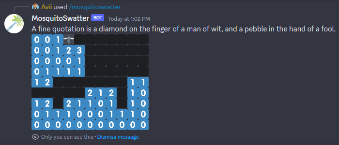

# Mosquito Swatter

A minesweeper clone for discord but instead of mines, you'll get stung by a mosquito.

# Invite link

[Add to your server](https://discord.com/oauth2/authorize?client_id=1212506405240836199&scope=bot)

The bot does not require any permissions aside from "create slash commands"

# Usage

In any channel to bot has access to use the `/mosquitoswatter` command

# Options

  - `width` Width of the board, between 3 and 11 (default: 11)
  - `height` Height of the board, between 3 and 9 (default: 9)
  - `mosquitos` Amount of mosquitos, between 1 and (width*height-1) (default: 10)
  - `private` Reply with a message only you can see (default: true)

# FAQ:

Q: The board is completely revealed when I issue the command!

A: The bot makes use of discords spoiler tags, make sure they don't auto-reveal in "User Settings -> Chat -> Show Spoiler Content"